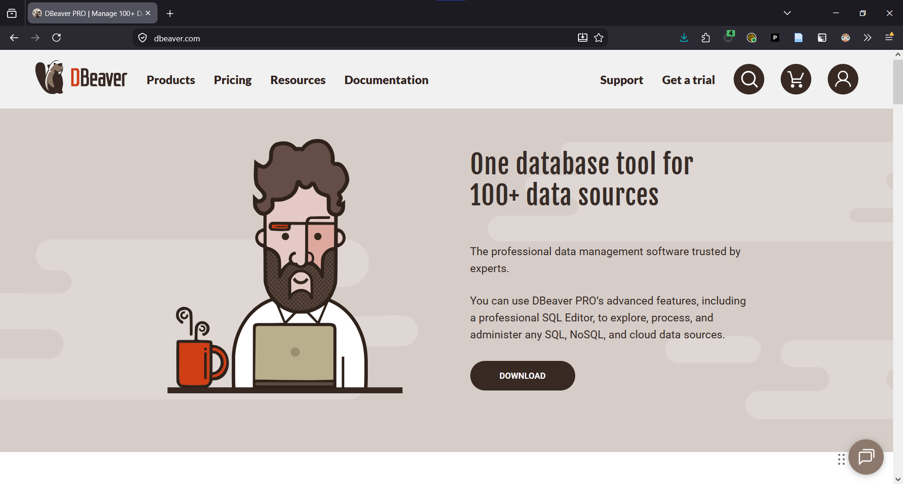
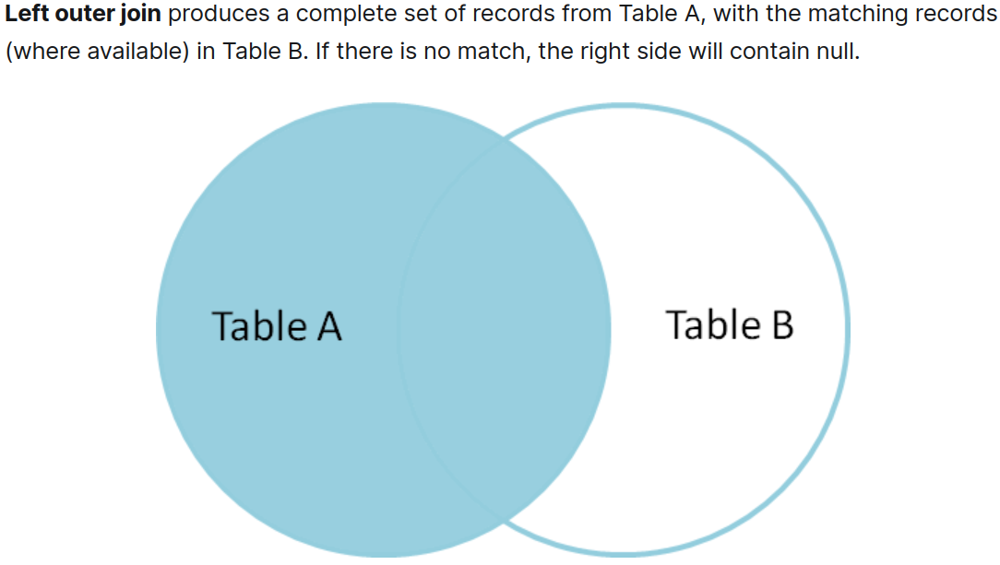
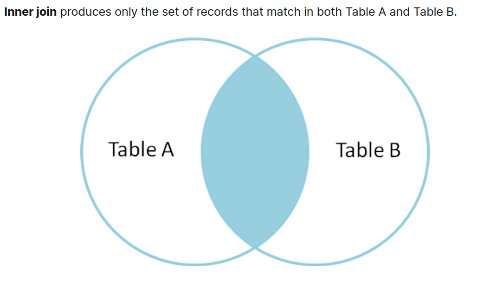
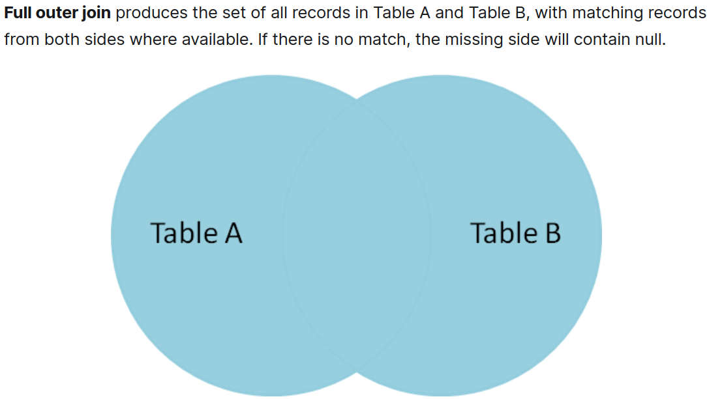

## Why this workshop?

Early-career faculty and graduate researchers in precision livestock technology often face the same pattern:

- wearable data are large, messy, and joined across many sources
- geospatial workflows need more than spreadsheets and ad hoc scripts
- the best database and analytical process choice depends on the research question

## What We Will Cover

- why databases help with wearable research workflows
- relational joins for combining sensor and metadata tables
- spatial analysis patterns for GPS data
- time-series queries for accelerometer and event streams
- example R scripts using `DBI` with `duckdb`

## One-Hour Agenda

| Time | Segment |
|---|---|
| 0:00-0:10 | Shared foundation: why use a database for livestock research? |
| 0:10-0:25 | Topic 1: joins |
| 0:25-0:40 | Topic 2: spatial analysis |
| 0:40-0:55 | Topic 3: time series |
| 0:55-1:00 | Wrap-up and next steps |

## Typical research data stack

- device streams: GPS fixes, accelerometer bursts, derived activity scores
- context tables: animal metadata, treatment groups, pasture assignments
- environmental layers: weather, vegetation, water points, paddock boundaries
- outputs: summaries, movement metrics, maps, figures, reproducible tables

## What Breaks First

- Millions of rows per deployment
- Repeated joins on timestamp and animal ID
- Geospatial operations done outside the analysis pipeline
- Multiple file formats with inconsistent metadata
- No clear separation between raw, cleaned, and derived data

## Why DuckDB plus DBI in R?

- DuckDB gives you fast local analytics without running a database server.
- `DBI` gives you a standard R interface for queries, tables, and results.
- This combination works well for teaching because the same ideas transfer to PostgreSQL later.

## Core R pattern

```r
library(DBI)
library(duckdb)

con <- dbConnect(duckdb(), dbdir = ":memory:")
on.exit(dbDisconnect(con, shutdown = TRUE), add = TRUE)
```

## How to View `.duckdb` Files

- DBeaver is a free GUI for DuckDB and supports 100+ other database engines

^[https://dbeaver.io/]

## Live DBeaver Demo

_switch to live demo_

## Topic 1: Joins

Why joins matter in wearable studies

- sensor records rarely mean much alone
- metadata usually lives in separate tables
- one analysis often combines animals, deployments, treatments, and observations

## Join Patterns

- `LEFT JOIN` to keep all sensor records and add context when available
- `INNER JOIN` when you only want matched records
- `FULL OUTER JOIN` when you want to see all records from both tables
- multi-table joins across animals, devices, and deployments
- grouped summaries after joins

## Left Join

^[https://blog.codinghorror.com/a-visual-explanation-of-sql-joins/]

## Inner Join

^[https://blog.codinghorror.com/a-visual-explanation-of-sql-joins/]

## Full Outer Join

^[https://blog.codinghorror.com/a-visual-explanation-of-sql-joins/]

## Join SQL Example

```sql
SELECT
  gps.animal_id,
  gps.ts,
  animals.treatment_group,
  gps.speed_m_s
FROM gps_fixes AS gps
LEFT JOIN animals
  ON gps.animal_id = animals.animal_id
ORDER BY gps.animal_id, gps.ts;
```

## R Example In This Repo

Open up and run:

- `scripts/01_joins_duckdb.R`
- creates toy animal and GPS tables
- demonstrates `LEFT JOIN` and a grouped summary

## Topic 2: Spatial Analysis

Why spatial analysis belongs in the database

- GPS workflows are mostly joins, filters, and aggregation with geometry attached
- moving points in and out of separate GIS tools can fragment the pipeline
- database-side spatial logic is reproducible and easier to re-run

## Common Spatial Questions

- Which paddock was the animal in at a given time?
- How much time was spent near water or shade?
- Which animals crossed a virtual fence line?
- How do movement metrics differ by pasture?

## Spatial example with DuckDB

```sql
INSTALL spatial;
LOAD spatial;

SELECT
  gps.animal_id,
  paddocks.paddock_name,
  COUNT(*) AS fixes_in_paddock
FROM gps_points AS gps
JOIN paddocks
  ON ST_Within(gps.geom, paddocks.geom)
GROUP BY 1, 2;
```

## R Example In This Repo

Open up and run:

- `scripts/02_spatial_duckdb.R`
- loads the DuckDB spatial extension
- creates toy paddocks and GPS points from WKT
- uses `ST_Within` to classify points by paddock

## Topic 3: Time Series

Why time-series structure matters

- wearable data arrive in order and are interpreted in sequence
- analysts often need rolling summaries, time gaps, and daily aggregation
- timestamps, timezone policy, and deployment intervals have to be consistent

## Common Time-Series Questions

- when did the collar stop transmitting?
- how active was each animal by hour or day?
- where are the large gaps or bursts in the sensor stream?
- how do we summarize high-frequency observations without losing provenance?

## Time-Series Example

```sql
SELECT
  animal_id,
  ts,
  activity_count,
  LAG(ts) OVER (PARTITION BY animal_id ORDER BY ts) AS previous_ts,
  ts - LAG(ts) OVER (PARTITION BY animal_id ORDER BY ts) AS gap
FROM accel_events
ORDER BY animal_id, ts;
```

## R Example In This Repo

Open up and run:

- `scripts/03_time_series_duckdb.R`
- creates a toy activity stream
- uses window functions for lagged timestamps and gap detection
- rolls up activity by hour

## Workflow Recommendations

1. Keep raw files immutable.
2. Load cleaned tables into DuckDB through R.
3. Use SQL for joins, spatial filters, and time-based summaries.
4. Export small derived tables for plotting and modeling.

## Common Mistakes

- doing all joins manually in spreadsheets
- reading the same large CSV files repeatedly in notebooks
- mixing raw, cleaned, and derived data in one table
- delaying timestamp standards until late in the project

## Wrap-up

If You Remember Only 3 Things

1. Databases help most when they remove repeated manual joins and summaries.
2. Spatial and time-series logic can live in the same analytical workflow.
3. `DBI` plus `duckdb` is a practical on-ramp for R-based research teams.

## Next Steps (On Your Own)

- port one real analysis from CSV-driven code to DuckDB
- standardize one relational schema for animals, deployments, and observations
- extend the example scripts to your own GPS or accelerometer data

## Discussion

Which of these topics would you like to see as the next hands-on session?